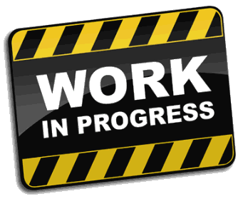
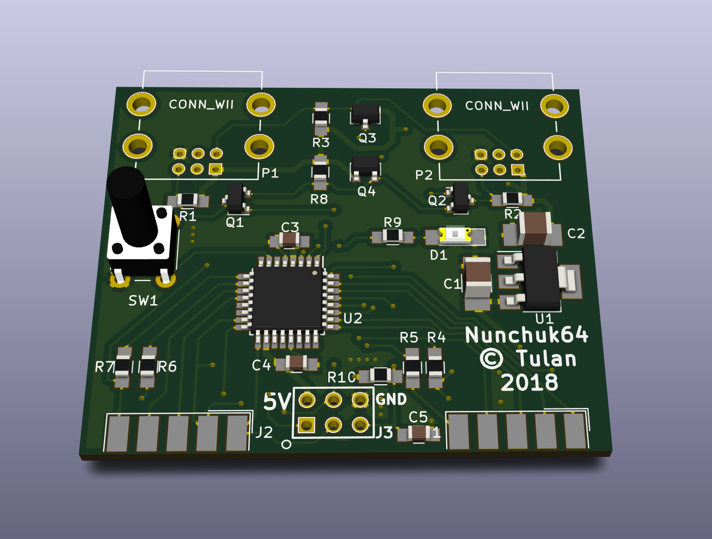
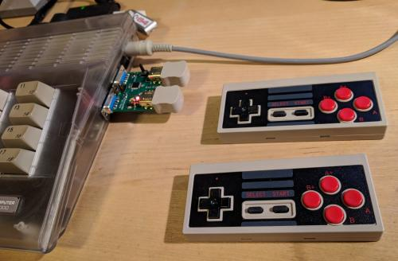

# Nunchuk64
Converter to connect for Wii Nunchuk or Nindendo NES Classic Mini Controller
to a Commodore 64. The circuit converts two Nintendo Controllers to two
Commodore 64 ones. Both digital and analog inputs of the Commodore are
controlled.

This is my very first project designing a PCB with a layouting tool.
I introduced myself into KiCad which satisfied my needs perfectly.
The KiCad project is provided inside subfolder ["hardware"](./hardware).

The project is still in progress, because I need to finish the firmware for the
ATMega328p chip it was made us of.

## 3D Picture
 

## Milestones
- ☑ Tested with "Nindendo NES Classic Mini Controller" replica
- ☑ Tested with "original Nindendo Nunchuk Controller"
- ☑ Tested with "Nindendo Nunchuk Controller" replica
- ☑ Tested with different other NES/SNES Clones
- ☐ Analog input like Nunchuk or Analog Gamepad

## Supported and tested Hardware
Currently the following hardware is supported (see [Supported Controllers](./supported_controllers))

## Dependecies
- KiCad to work in schematic and layout (see [KiCad](http://kicad-pcb.org/))
- avr-gcc toolchain for compiling the firmware

## My personal project goals
- ☑ learn KiCad design workflow
- ☑ learn how to layout PCBs with SMD parts
- ☑ learn about SMD sizes and package types
- ☑ order a PCB from a professional manufactorer
- ☑ learn programming AVR chips

