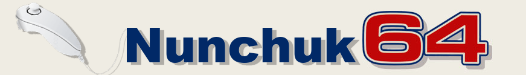

Nunchuk64 is a converter or adapter to connect a Wii Nunchuk or a Nindendo NES Classic Mini Controller
to a Commodore 64. The circuit converts two Nintendo Controllers into two Commodore 64 ones.
All types of the Commodore 64 inputs, which means digital and analog inputs, are available.

## Introduction Video
User [dukestah] from [Forum64](https://www.forum64.de) made a nice introduction video.
He gives a short introduction how the thing works in basic and demonstrates the functions while playing a game.

It is my very first project designing a PCB with a layouting tool.
I introduced myself into KiCad which satisfied my needs perfectly.
The KiCad project is provided inside subfolder ["hardware"](./hardware).

The project is still in progress, because I need to finish the firmware for the
ATMega328p microcontroller.

## 3D Picture

## Milestones
- ☑ Tested with a "Nindendo NES Classic Mini Controller" clone
- ☑ Tested with a "original Nindendo Nunchuk Controller"
- ☑ Tested with a "Nindendo Nunchuk Controller" clone
- ☑ Tested with different other NES/SNES Classic Mini clones

## Supported and tested Hardware
Currently the following hardware is supported (see [Supported Controllers](./supported_controllers))

## Dependecies
- KiCad to work in schematic and layout (see [KiCad](http://kicad-pcb.org/))
- avr-gcc toolchain for compiling the firmware

## Personal project goals reached
- ☑ learn KiCad design workflow
- ☑ learn how to layout PCBs with SMD parts
- ☑ learn about SMD sizes and package types
- ☑ order a PCB from a professional manufactorer
- ☑ learn programming AVR chips
