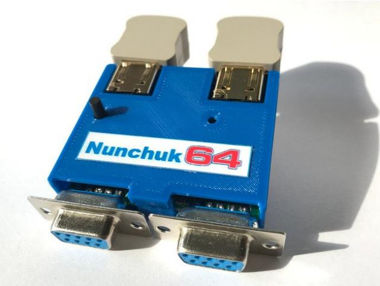
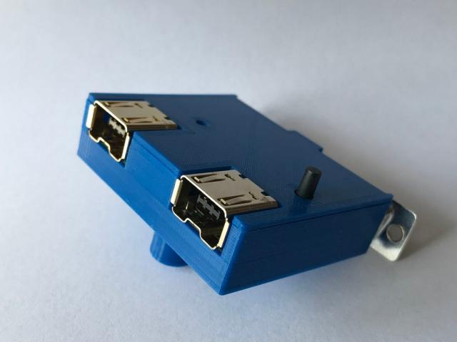
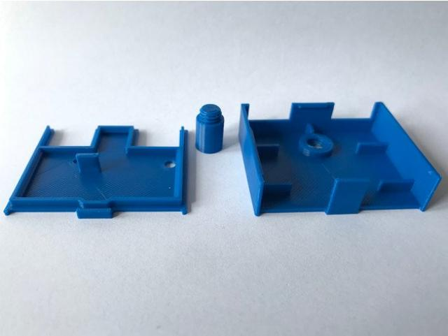
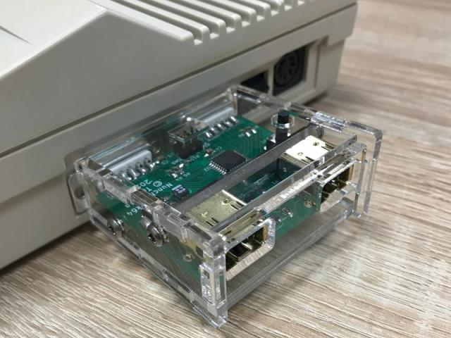
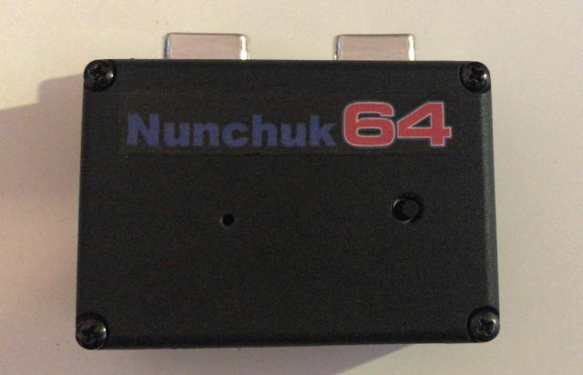
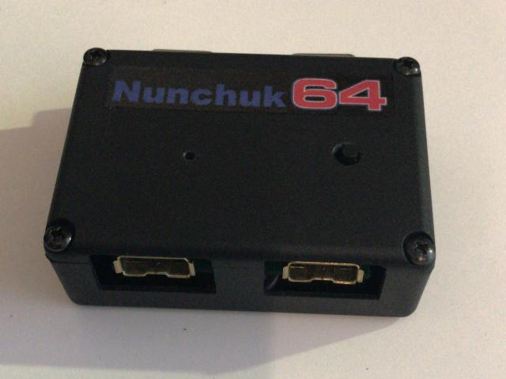
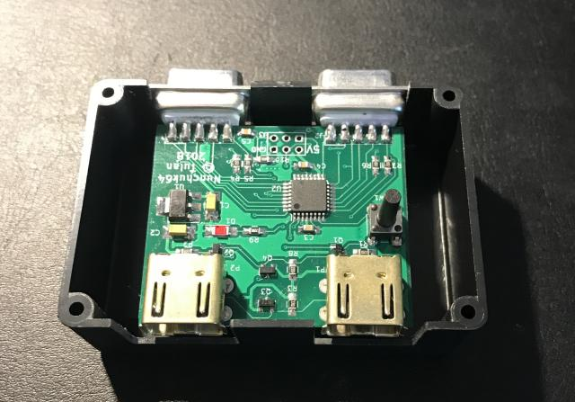

Nunchuk64 Cases
==============

There are already some cases available for the Nunchuk64.

Case by hackup (https://www.hackup.net/)
----------------------------------------
A realy nice case for friends of 3D printing.
https://www.thingiverse.com/thing:3560915

Case by plexilaser (Michael Schön)
----------------------------------
A case made from acrylic glass is available at the plexolaser shop:
https://www.plexilaser.de/Acrylgehaeuse-fuer-Nunchuck64-Adapter-Teilesatz

Case made from an universal case by Dirk Willke
----------------------------------------------
This nice case is made from a universal case available at conrad.

https://www.conrad.de/de/strapubox-2024-universal-gehaeuse-72-x-50-x-26-abs-schwarz-1-st-522635.html

Strapubox 2024 Universal-Gehäuse 72 x 50 x 26 ABS Schwarz

