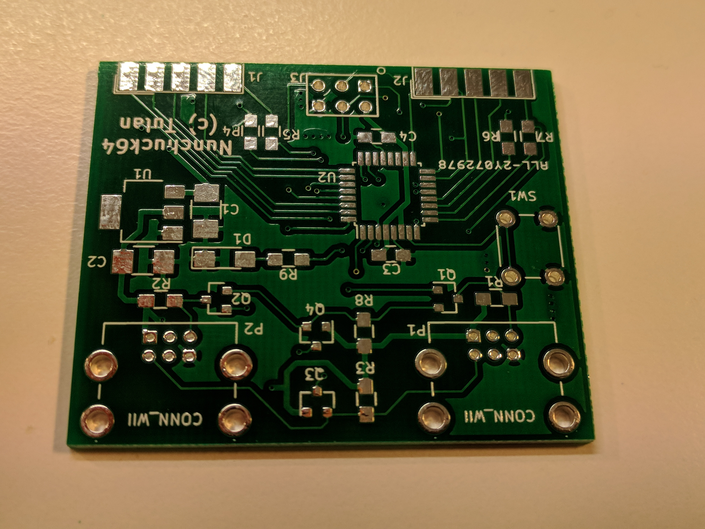
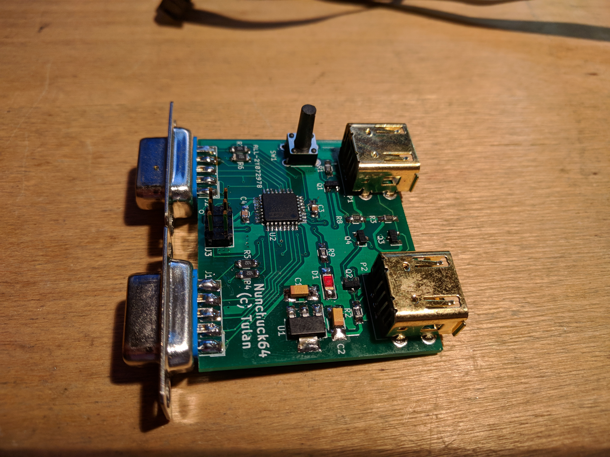
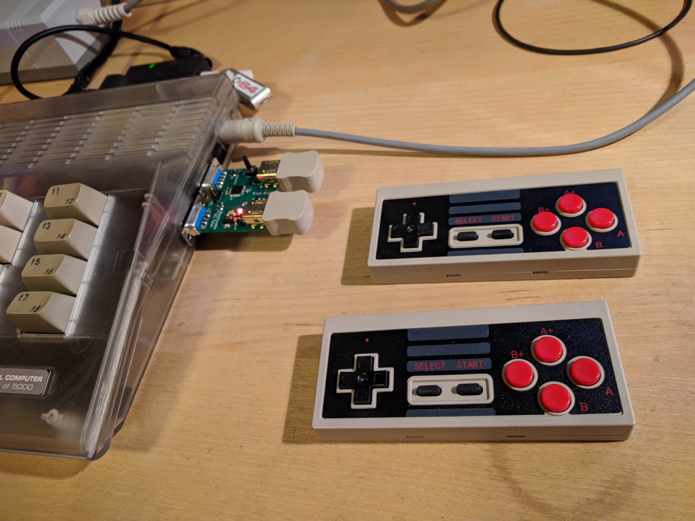

Hardware
==============
In this folder you can find all the needed parts to order the pcb.
The subfolder "nunchuk64" hold the KiCad project and Gerber files.

BOM
---
| Name           |Quantity|Value         |Footprint                     |
| ---------------|--------|--------------|------------------------------|
| U1             | 1      |AMS1117-3V3   |SOT-223                       |
| U2             | 1      |SPACE         |TQFP-32_7x7mm_Pitch0.8mm      |
| C1,C2          | 2      |22uF Tantalum |Tantalum_Case-A_EIA-3216-18   |
| C3,C4,C5       | 3      |100n          |0805                          |
| D1             | 1      |LED           |LED_1206                      |
| J1,J2          | 2      |DB9_Female    |UP                            |
| J3             | 1      |2x3 pin       |RIGHT                         | 
| P1,P2          | 2      |CONN_WII      |DOWN                          |
| Q1,Q2,Q3,Q4    | 4      |BSS138        |UP                            |
| R9             | 1      |220           |0805                          |
| R4,R5,R6,R7,R10| 5      |10K           |0805                          |
| R1,R2,R3,R8    | 4      |2,2K          |0805                          |
| SW             | 1      |SW_Push       |Buttons Switch 6mm 13mm lenght|

The ready PCBs
--------------

PCB with parts
--------------

connected to C64:
--------------

