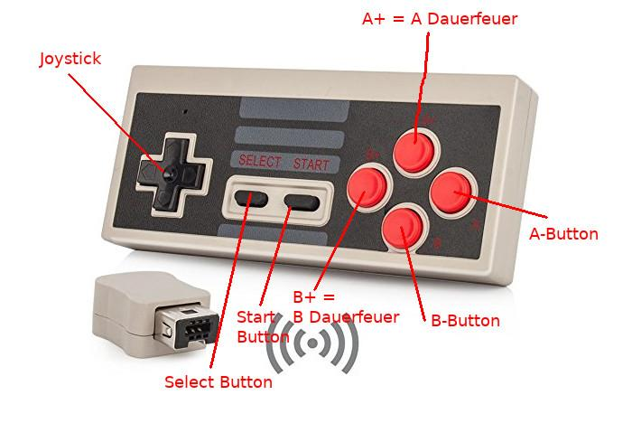
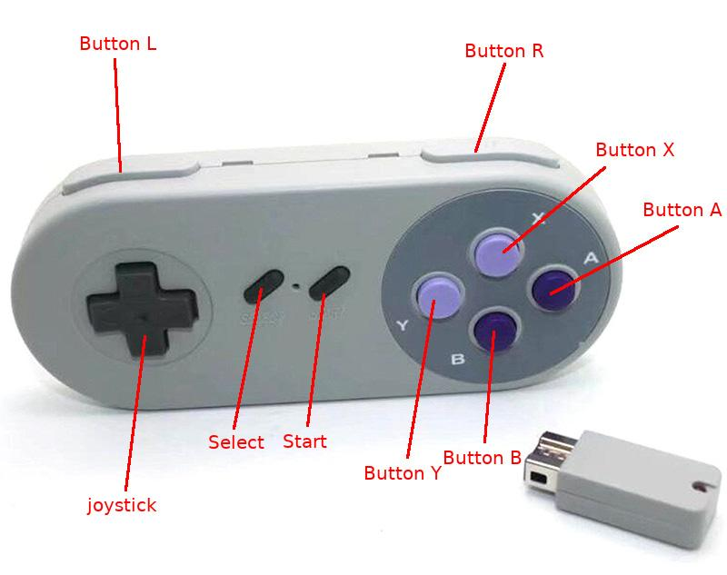
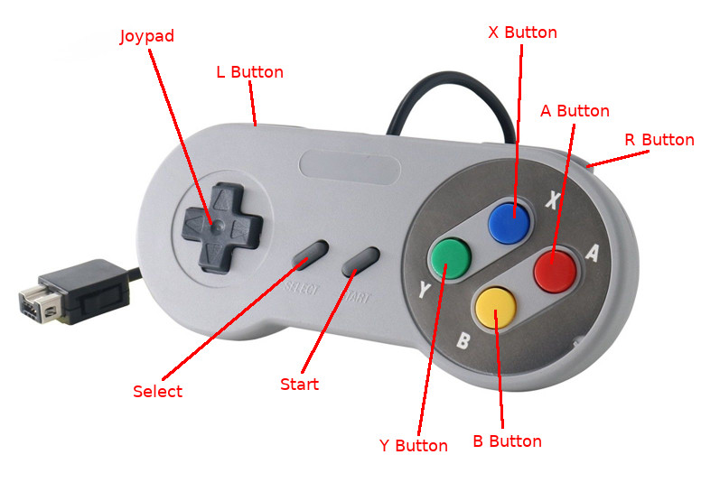
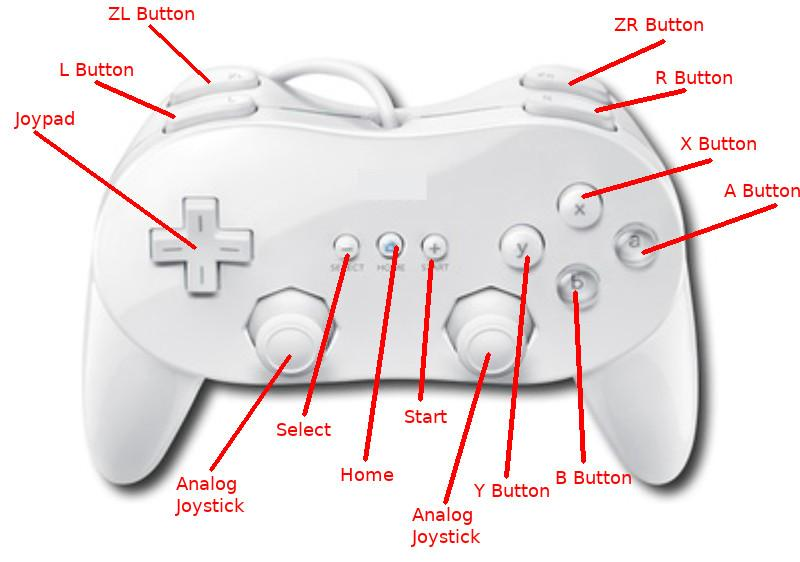
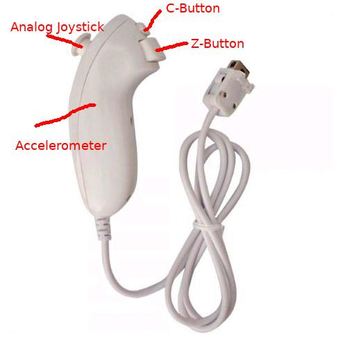

# Supported Controllers

This is an overview of all tested controllers.
Since they all mostly use the same datasets, it is very likely that other controllers will work too.
Pressing the pushbutton switches the Nunchuk64 to different modes.

- Mode OFF ... LED is OFF
- Mode ON  ... LED is ON
- Mode F1  ... LED flashes 1 time
- Mode F2  ... LED flashes 2 times

Depending on the mode the controllers behaves differently.
Nunchuk64 can perform these different controls on each individual C64 Control Port:

- UP
- DOWN
- LEFT
- RIGHT
- FIRE
- AUTOFIRE
- PADDLE X
- PADDLE Y
- SECOND FIRE BUTTON
- SECOND AUTOFIRE BUTTON
- THIRD FIRE BUTTON
- THIRD AUTOFIRE BUTTON

An extra function is SPACE, which triggers FIRE on controller port 1.
This is very handy because you can use it to press the space bar.
For SECOND FIRE / THIRD FIRE C64s analog paddle input X,Y are used, similar the Cheetah Annihilator Joystick.
See https://www.c64-wiki.de/wiki/Joystick#Weitere_Feuerkn.C3.B6pfe

## NES Classic Mini Clone
Wireless Controller for Nintendo NES Mini Classic Edition.

Seen here: https://www.ebay.com/itm/272765627224
> Button A+ and B+ are same as A and B but with autofire!

> Nintendo original NES Classic Mini is using the driver_wii_classic!

DRIVER: [https://github.com/djtulan/nunchuk64/blob/master/src/driver_nes_classic.c](driver_nes_classic.c)

| Item          |Mode OFF  |Mode ON   |Mode F1   |Mode F2   |
| --------------|----------|----------|----------|----------|
| Joystick UP   |UP        |UP        |UP        |UP        |
| Joystick DOWN |DOWN      |DOWN      |DOWN      |DOWN      |
| Joystick LEFT |LEFT      |LEFT      |LEFT      |LEFT      |
| Joystick RIGHT|RIGHT     |RIGHT     |RIGHT     |RIGHT     |
| A             |UP        |UP        |UP        |UP        |
| B             |FIRE      |FIRE      |FIRE      |FIRE      |
| A+            |UP        |UP        |UP        |UP        |
| B+            |FIRE      |FIRE      |FIRE      |FIRE      |
| SELECT        |FIRE      |FIRE      |FIRE      |FIRE      |
| START         |SPACE     |SPACE     |SPACE     |SPACE     |

## SNES Classic Mini Clone
Wireless Controller for Nintendo SNES Mini Classic Edition.

Seen here: https://www.ebay.com/itm/162874713501

Wired Controller for Nintendo SNES Mini Classic Edition.

Seen here: https://www.ebay.at/itm/222674575659

DRIVER: driver_wii_classic.c

| Item          |Mode OFF  |Mode ON   |Mode F1   |Mode F2   |
| --------------|----------|----------|----------|----------|
| Joystick UP   |UP        |UP        |UP        |UP        |
| Joystick DOWN |DOWN      |DOWN      |DOWN      |DOWN      |
| Joystick LEFT |LEFT      |LEFT      |LEFT      |LEFT      |
| Joystick RIGHT|RIGHT     |RIGHT     |RIGHT     |RIGHT     |
| A             |UP        |UP        |UP        |UP        |
| B             |FIRE      |FIRE      |FIRE      |FIRE      |
| X             |FIRE      |FIRE      |FIRE      |FIRE      |
| Y             |AUTOFIRE  |AUTOFIRE  |AUTOFIRE  |AUTOFIRE  |
| SELECT        |FIRE      |FIRE      |FIRE      |FIRE      |
| START         |SPACE     |SPACE     |SPACE     |SPACE     |
| L             |LEFT      |LEFT      |LEFT      |LEFT      |
| R             |RIGHT     |RIGHT     |RIGHT     |RIGHT     |

## Wii classic controller
Wii Classic Controller for Nintendo Wii Remote. (Wired)

Seen here: https://www.ebay.com/itm/291645811767

DRIVER: driver_wii_classic.c

| Item          |Mode OFF  |Mode ON   |Mode F1   |Mode F2   |
| --------------|----------|----------|----------|----------|
| Joystick UP   |UP        |UP        |UP        |UP        |
| Joystick DOWN |DOWN      |DOWN      |DOWN      |DOWN      |
| Joystick LEFT |LEFT      |LEFT      |LEFT      |LEFT      |
| Joystick RIGHT|RIGHT     |RIGHT     |RIGHT     |RIGHT     |
| A             |UP        |UP        |UP        |UP        |
| B             |FIRE      |FIRE      |FIRE      |FIRE      |
| X             |FIRE      |FIRE      |FIRE      |FIRE      |
| Y             |AUTOFIRE  |AUTOFIRE  |AUTOFIRE  |AUTOFIRE  |
| SELECT        |FIRE      |FIRE      |FIRE      |FIRE      |
| HOME          |-         |-         |-         |-         |
| START         |SPACE     |SPACE     |SPACE     |SPACE     |
| L             |LEFT      |LEFT      |LEFT      |LEFT      |
| ZL            |-         |-         |-         |-         |
| R             |RIGHT     |RIGHT     |RIGHT     |RIGHT     |
| ZR            |-         |-         |-         |-         |
| LX (Analog)   |LEFT/RIGHT|LEFT/RIGHT|LEFT/RIGHT|PADDLE X  |
| LY (Analog)   |UP/DOWN   |UP/DOWN   |UP/DOWN   |PADDLE Y  |
| RX (Analog)   |-         |-         |-         |-         |
| RY (Analog)   |-         |-         |-         |-         |

## Wii Nunchuck
Wii Nunchuck Controller for Nintendo Wii Remote

DRIVER: driver_nunchuk.c

| Item          |Mode OFF  |Mode ON   |Mode F1   |Mode F2   |
| --------------|----------|----------|----------|----------|
| Analog Joy X  |LEFT/RIGHT|-         |-         |PADDLE X  |
| Analog Joy Y  |UP/DOWN   |-         |-         |PADDLE Y  |
| Accel X       |-         |LEFT/RIGHT|PADDLE X  |-         |
| Accel Y       |-         |UP/DOWN   |PADDLE Y  |-         |
| Accel Z       |-         |-         |-         |-         |
| C             |AUTOFIRE  |AUTOFIRE  |AUTOFIRE  |AUTOFIRE  |
| Z             |FIRE      |FIRE      |FIRE      |FIRE      |
